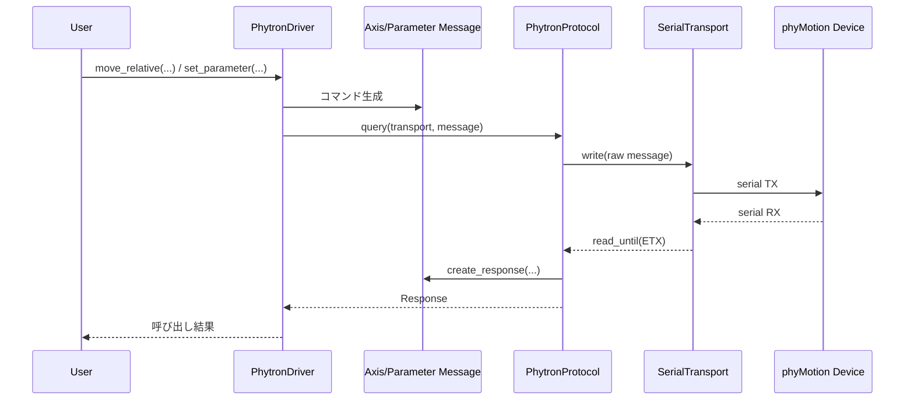

# phytron-phyMotion コード構成

このドキュメントは、`phytron_phymotion` パッケージの責務分割と依存関係を簡潔に示します。

## 構成概要

- **factory**: 利用者向けのエントリポイント。`PhytronDriver` を組み立てる。
- **driver**: 操作API（移動、停止、パラメータ読み書き）を提供。
- **protocol**: メッセージ送信・受信、チェックサム検証、エラー処理。
- **message / messages/**: コマンド・レスポンスの型定義。
- **transport**: `pyserial` でシリアルI/Oを抽象化。
- **errors**: 通信エラー型の定義。

## Mermaid 図

```mermaid
flowchart TD
    U[User Code] --> F[factory.py\nPhytronFactory]
    F --> T[transport.py\nSerialTransport\n(pyserial)]
    F --> P[protocol.py\nPhytronProtocol]
    F --> D[driver.py\nPhytronDriver]

    D --> M[message.py\nMessage / Response / AxisMessage]
    D --> MS[messages/*.py\nParameter/Clear/IsHolding/EndPhase/Arbitrary]
    D --> P

    P --> M
    P --> E[errors.py\nCommunicationError]
    P --> T

    MS --> M
```

## 主要データフロー



## ファイル対応（実装）

- `phytron_phymotion/factory.py`
- `phytron_phymotion/driver.py`
- `phytron_phymotion/protocol.py`
- `phytron_phymotion/message.py`
- `phytron_phymotion/messages/`
- `phytron_phymotion/transport.py`
- `phytron_phymotion/errors.py`
